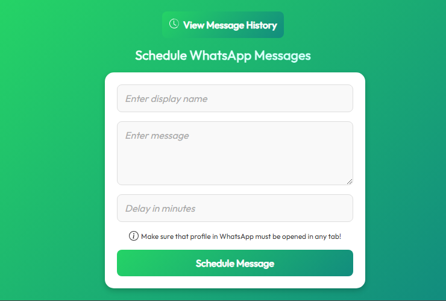
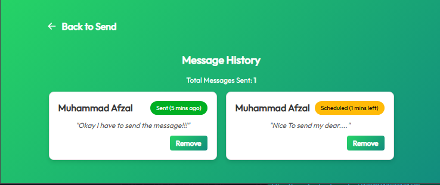
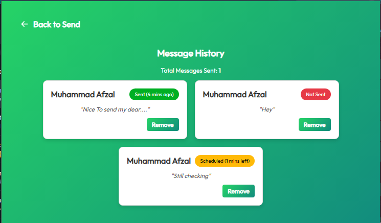

# WhatsApp Scheduler Chrome Extension

This Chrome extension allows users to schedule messages for WhatsApp Web. It ensures messages are sent at a specified time and provides a clear history of sent, unsent, and scheduled messages.

---

## How to Use

### **Step 1: Open Chrome and Launch WhatsApp Web**

1. Open Google Chrome.
2. Launch WhatsApp Web by navigating to `https://web.whatsapp.com/`. Make sure you scan the QR code with your phone if you haven't logged in already.

   **Screenshot:**  
   

---

### **Step 2: Add Scheduled Message Information**

1. Enter the **Display Name** or **Phone Number** of the recipient.
   - The display name must match the name of the person in your WhatsApp contacts.
2. Type your **message** in the provided field.
3. Set a **schedule time** for when you want the message to be sent.
4. Click the "Schedule" button to save the message.

   **Screenshot:**  
   

---

### **Step 3: View Message History and Status**

1. Open the **History** tab in the extension.
2. You can view all messages scheduled in the last 24 hours, categorized as:
   - **Sent:** Messages successfully sent.
   - **Not Sent:** Messages not sent due to the profile not being open or other reasons.
   - **Scheduled:** Messages scheduled for a future time.
3. You can also remove any unwanted scheduled messages directly from the history list.

   **Screenshot:**  
   
   

---

## Features

- **Automated Scheduling:** Messages are sent automatically at the scheduled time.
- **Profile Validation:** Ensures the recipient’s WhatsApp profile is open before sending the message.
- **Message History:** View sent, unsent, and scheduled messages within the last 24 hours.
- **Remove Scheduled Messages:** Delete scheduled messages directly from the history tab.

## Permissions Required

- `tabs`: To interact with WhatsApp Web tabs.
- `scripting`: To run scripts for sending messages.
- `storage`: To save scheduled messages.
- `notifications`: To notify users of any issues or successes.

## Disclaimer

This extension is for personal use only and is not affiliated with or endorsed by WhatsApp.